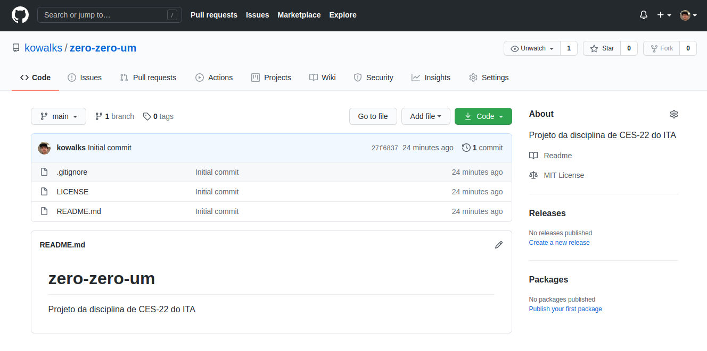

# zero-zero-um

Projeto da disciplina de CES-22 do Instituto Tecnológico de Aeronáutica

Equipe:
* Arthur José de Sousa Rodrigues
* Fernando Gusmão Zanchitta
* Gabriel Henrique Gobi
* Guilherme Goulart Kowalczuk
* Thiago Lopes de Araujo
* Yuri Gama

## 1. Descrição

O gênero de jogo *dungeon crawler* é um tipo de RPG que consiste na livre-exploração de mapas temáticos, a fim de completar determinadas quests ou desafios propostos. É caracterizado principalmente por um personagem, inicialmente preso em uma espécie de masmorra a procura de cumprir os objetivos propostos, tendo que enfrentar inimigos pelo caminho e explorar o mapa para encontrar itens chave de melhoria.

A proposta de projeto é fazer um jogo do estilo *dungeon crawler* de vista superior em 8-bits. O personagem que o jogador controla é um bixo -- aluno do primeiro ano do ITA -- que é posto para explorar um mapa de layout randômico a cada novo jogo. O objetivo principal da história é fazer o jogador explorar o mapa, até encontrar um item que destrave a saída da "*dungeon*". Nesse caminho, o jogador é surpreendido com alguns inimigos a serem combatidos e encontra itens que poderão facilitar sua jornada.

Ao interagirem, o jogador e os adversários são postos para batalhar em um combate em turnos. Cada um recebe um determinado nível de vida, e atacam alternadamente um ao outro. As habilidades do personagem principal podem evoluir com o tempo, conforme ele coleta itens no mapa. Se, por acaso, perde um combate, o jogo é reiniciado.

## 2. Motivação

Desenvolver técnicas mais avançadas de programação, como:
* Aplicação de POO;
* Programação de interfaces (GUI);
* Padrões básicos de projetos;
* Desenvolvimento básico de gráficos em 8-bits;
* Dominar a linguagem Python, com foco na biblioteca PyGame, e no integrado do Git.

Para o desenvolvimento do nosso jogo de gênero *dungeon crawler*, decidiu-se customizá-lo com uma narrativa, personagens e elementos próprios do universo de alunos do ITA. Assim, espera-se que o jogo seja bem aceito pela comunidade e mostre o quão legal algo pode ser feito por iteanos com o uso da programação.

## 3. Técnicas e Recursos

A ideia é usar a biblioteca PyGame, da linguagem de programação Python. Tentaremos aplicar os conceitos de programação modular e orientada a objetos para construir as diversas mecânicas do jogo. Isso inclui fazer classes e métodos especiais para o personagem principal, para os itens que gerados no mapa e para os monstros que aparecem no jogo, por exemplo. Já para a customização gráfica do jogo, serão usadas artes feitas pelo *Pixilart*, um site gratuito para desenho em 8-bits em que diversos criadores compartilham suas ilustrações.

O gerenciamento de configuração e versionamento será feito com o auxílio do GitHub da equipe, onde estarão depositados os códigos escritos em Python, bem como as configurações da IDE, os builds e os recursos gráficos usados. Cada integrante do grupo terá sua própria aba de desenvolvimento, que serão unidas em uma só ao final do projeto. O GitHub pode ser acessado clicando [aqui][1].

## 4. Planejamento da equipe

Um dos integrantes, Guilherme, será responsável por liderar o projeto e dividir as tarefas principais. Vai ser o membro do grupo responsável por garantir que todos os trechos de código, ao final, façam sentido entre si. Para melhor organização das atividades, foi criado uma página no *Notion*, que servirá de guia para que o time converse e saiba das atividades que estão sendo desenvolvidas. Nela, além do calendário com atividades e um quadro organizacional Kanban, há espaços para colocar referências e inspirações. A página pode ser acessada clicando [aqui][2].

## 5. Registro de Evidências

Ao final do projeto, será disponibilizado o código completo como repositório no GitHub, sob o link https://github.com/kowalks/zero-zero-um. Produziremos também um executável do jogo e um pequeno vídeo-apresentação mostrando as funcionalidades do jogo criado. 

[1]: https://github.com/kowalks/zero-zero-um
[2]: https://www.notion.so/kowalks/Projeto-CES-22-a2e6df24c5dc484eaf110a69ac01da68

## 6. Screenshots do jogo

